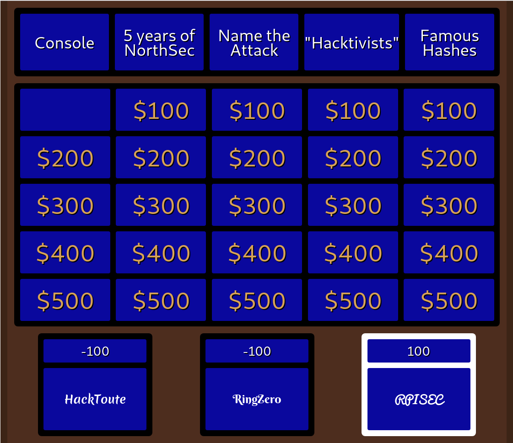
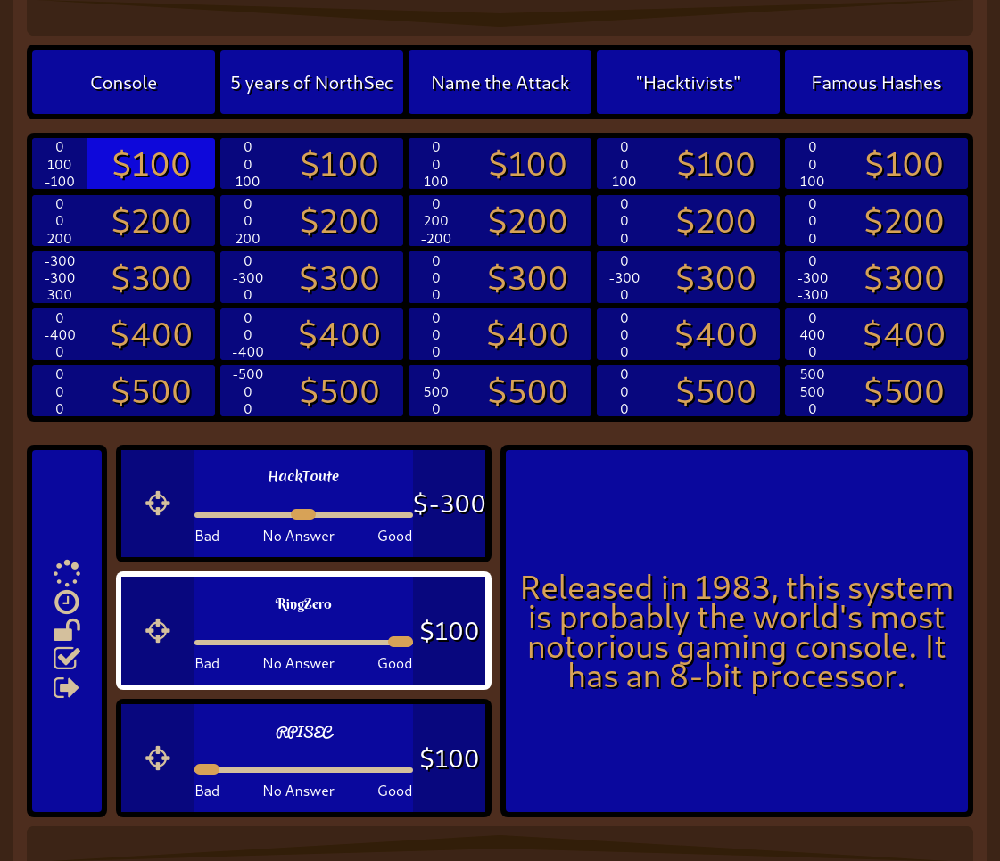

= Ceopardy

The Hacker Jeopardy Game Board we use at NorthSec.

== Screenshots

This is what the crowd sees:

When a clue is displayed:

image::docs/images/viewer-clue.png[The Viewer Interface Displaying a Clue]

This is the host interface, how you control the game:

Note that there are two drawers that can be opened by clicking on the brown
arrows at the top and at the bottom of the screen. The top drawer contain the
functions to change team names. The bottom drawer provides functions to
display a custom message on the board or to pause a game.

== First time deployment

You need Python, pip, virtualenv and npm. The tl;dr:

    python -m venv .venv/
    source .venv/bin/activate
    pip install -r requirements.txt
    npm install
    npm run copy-assets
    python ceopardy.py

== Setup

=== Display

You need at least 2 outputs: one for the game host for control and one for the
public.

At NorthSec 2017, we used 3 outputs because we didn't have the proper gear to
duplicate the public output for a stage monitor. There is a script in
`helpers/` that will set 3 outputs using `xrandr`. It didn't work with a GUI
tool when we tried at that time.

== Prepare a game

Game data goes in `data/`. There you should add round files (create a `.round`
file) and questions in `Questions.cp`. The format is pretty self explanatory.
Check `data/` for an example.

== Running

    python ceopardy.py

Then open http://127.0.0.1:5000/host[the host view] and setup the game.
http://127.0.0.1:5000/[The players' view] (also known as the viewer) can be
opened at any time. Nothing will be displayed until the game is started by
the host.

NOTE: In order to avoid dataloss due to a crash, Ceopardy is backed by a
database where transactions are pushed when the hosts submit the points. This
has the flipside requiring games to be finalized before a new one can be
started. Make sure that you always push the "Game over" button before
reloading to start a new game.

== Dev

Use appropriate node version. A `.nvmrc` file exists to ease setup.
Once you have https://github.com/nvm-sh/nvm#nvmrc[installed nvm adequately] (or https://github.com/jorgebucaran/nvm.fish[with fish]):

    nvm use

=== Front-End

    npm run dev
