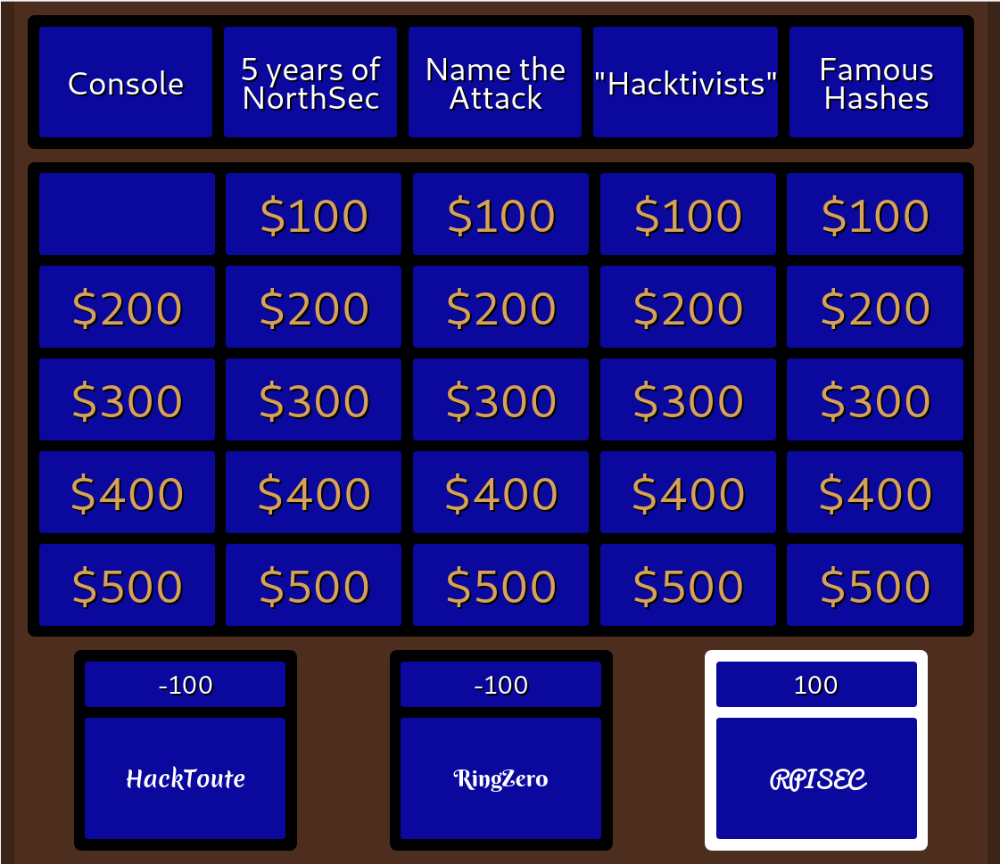
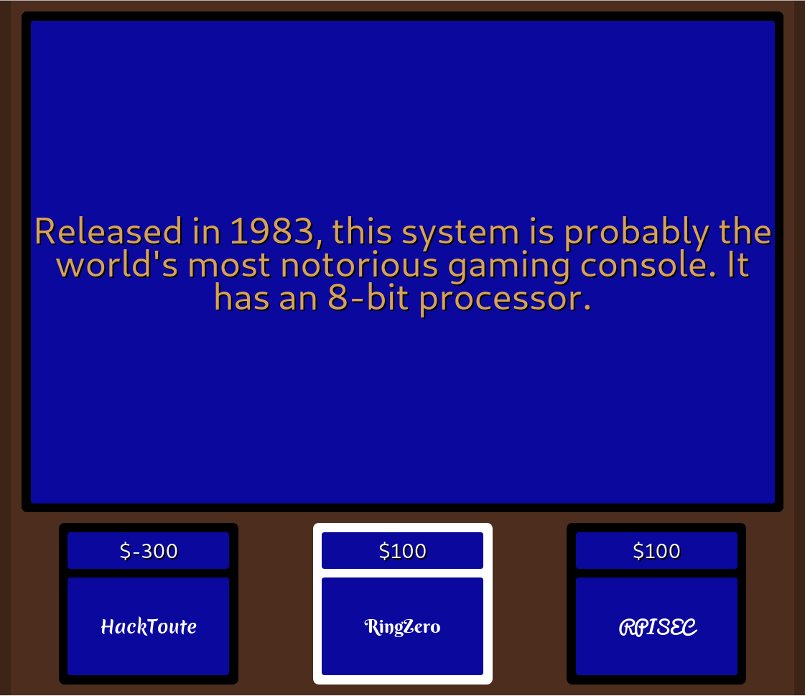
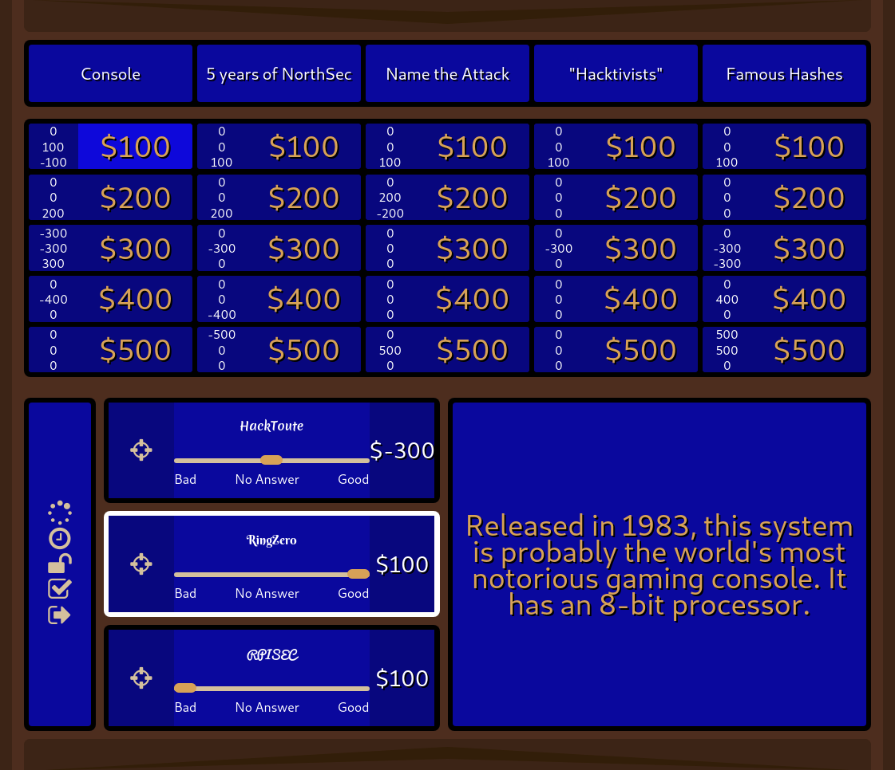

# Ceopardy

The Hacker Jeopardy Game Board we use at NorthSec.

## Screenshots

This is what the crowd sees:

When a clue is displayed:

This is the host interface, how you control the game:

Note that there are two drawers that can be opened by clicking on the brown
arrows at the top and at the bottom of the screen. The top drawer contains
the functions to change team names. The bottom drawer provides functions to
display a custom message on the board or to pause a game.

## Architecture

Starting with v0.5, Ceopardy is split in two parts:

- A Python/Flask back-end that exposes a small REST API (`/api/v1/...`) and
  broadcasts state changes over a single Socket.IO namespace (`/game`).
- A Vite + Vue 3 + TypeScript front-end (in `frontend/`) that powers the
  crowd-facing viewer, the host UI, and the start screen.

Ceopardy is designed for single-operator local-network use: the server binds
to `127.0.0.1` and there is no authentication on the host UI. If you need to
expose it on a LAN, put your own reverse proxy (and auth) in front.

## Running Ceopardy (operators)

For people who just want to host a game.

Install [pipx](https://pipx.pypa.io/), then install the latest release wheel
(requires `curl` and `jq`):

    pipx install "$(curl -fsSL https://api.github.com/repos/obilodeau/ceopardy/releases/latest | jq -r '.assets[] | select(.name | endswith(".whl")) | .browser_download_url')"

Or pin a specific version from the
[releases page](https://github.com/obilodeau/ceopardy/releases):

    pipx install https://github.com/obilodeau/ceopardy/releases/download/v0.6.0/ceopardy-0.6.0-py3-none-any.whl

Then scaffold a per-game directory and start the server:

    mkdir my-game && cd my-game
    ceopardy init               # writes data/ + game-media/ starter content
    # edit data/Questions.cp and data/1st.round to set up your game
    ceopardy serve              # starts the server on http://127.0.0.1:5000/
    ceopardy serve --debug      # add verbose logging + auto-reload

Open the two URLs `ceopardy serve` prints:

- Viewer: <http://localhost:5000/> — what the crowd sees on the projector.
- Host:   <http://localhost:5000/host> — what you (the operator) drive.

`ceopardy init` never overwrites existing files; it's safe to re-run. The
SQLite database, round files, and uploaded media all resolve relative to the
directory you run `ceopardy` from, so **keep one directory per game**.

> **Note:** Ceopardy persists transactions to a SQLite database as the host
> submits points, so a crash doesn't lose the game state. The flipside is
> that games must be finalized (click "Game over") before a new one can be
> started in the same directory.

## Hacking on Ceopardy (developers)

You need Python 3.11+, pip, virtualenv, and Node.js (LTS).

    git clone https://github.com/obilodeau/ceopardy.git
    cd ceopardy
    make venv                          # creates .venv/ + installs deps
    source .venv/bin/activate          # bash/zsh
    source .venv/bin/activate.fish     # fish
    make init                          # seeds data/ + game-media/
    make run                           # starts Flask (:5000) + Vite (:5173)

Then open <http://localhost:5173/> — Vite hot-reloads the UI and proxies
`/api` and `/socket.io` to Flask on `:5000`. **In dev, always use the Vite
URL** (`:5173`); the Flask port serves the *built* SPA which gets stale.

### Optional: direnv

If you use [direnv](https://direnv.net/), the repo ships an `.envrc` that
auto-activates `.venv` on `cd`. Run `make venv` first (direnv won't), then
`direnv allow`.

### Before committing

Run the full CI suite — same checks GitHub Actions runs:

    make ci      # ruff lint + format check + prettier + vue-tsc + pytest

To auto-fix Python formatting first:

    make format

See `AGENTS.md` for the conventions the codebase follows.

### Building a wheel locally

`make build` reproduces the release path (frontend bundle + sdist + wheel):

    make build
    pipx install --force dist/ceopardy-*.whl   # test the wheel end-to-end
